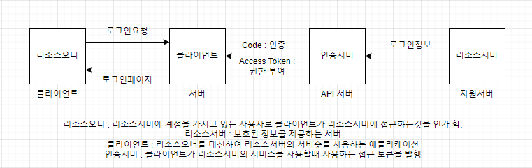

# Oauth2.0 Project

```
목적 : 사내 관리하고 있는 서비스들의 계정 관리의 편의성 증대를 위한 프로젝트
```


Dependencies
------------
- Thymeleaf
- Lombok
- Validation
- Spring Boot DevTools
- Spring Data JPA
- OAuth2 Client
- Spring Security
- Spring Web
- MariaDB
- H2


### JPA LocalDateTime 자동으로 생성하는 법
- @EnableJpaAuditing (Main 클래스)
- @EntityListeners(AuditingEntityListener.class) (Entity 클래스)
```java
@CreatedDate // INSERT
@Column(nullable = false)
private LocalDateTime createdAt;
    
@LastModifiedDate // INSERT, UPDATE
@Column(nullable = false)
private LocalDateTime updatedAt;
```

```
미구현 부분

- User 객체 oauth 구분 컬럼 추가
- 카카오를 통해 가입한 유저에 대한 가입/비가입 구분 처리 ....1
- 1번 후 회원가입(가입시 pw는 키로 고정하여 저장.. 다음번 로그인 처리생각), 로그인처리
- 프론트에서는 oauth를 통해 가입한 사용자의 정보 수정 정책 필요
- 로그아웃

- OAuth2UserService 라이브러리 사용해보기
- client_id, pw키는 yml or 환경변수 or AWS Secrets Manager로 관리하는 방법
- 네이버, 구글 추가
```